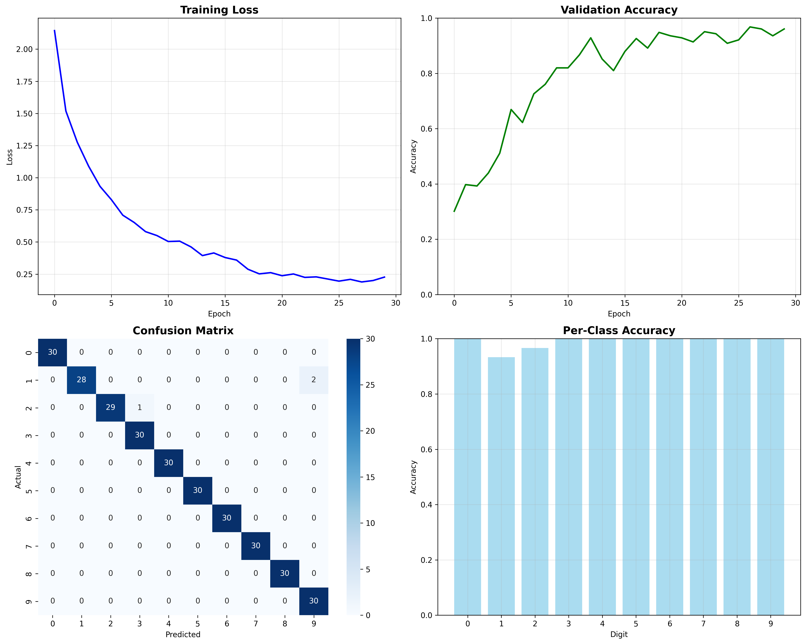

# Digit Classification from Audio - Enhanced Deep Learning System

An advanced digit classification system that recognizes spoken digits (0–9) using deep learning with CNN architecture and real-time microphone integration.

## 🎯 Overview

This project implements a comprehensive digit classification system featuring:
- **Real-time microphone recording** for live digit recognition
- **Enhanced CNN architecture** with attention pooling
- **Interactive GUI** with audio visualization
- **High accuracy** on the Free Spoken Digit Dataset
- **Cross-platform compatibility** (Windows, macOS, Linux)

## ✨ Key Features

### 🎤 **Microphone Integration & GUI**
- 1-second audio capture from microphone
- Interactive tkinter interface
- Real-time audio waveform visualization
- Prediction probability charts
- Support for audio file loading (WAV, MP3, FLAC, etc.)

### 🧠 **Enhanced Deep Learning Model**
- Advanced CNN with attention pooling
- Data augmentation (noise, time stretching, pitch shifting)
- Smart training with early stopping and learning rate scheduling
- Automatic device optimization (MPS/CUDA/CPU)

## 🏗️ Architecture

### Model Structure
```
Input (8000 samples @ 8kHz) 
    ↓
Conv1D Layers (64→128→256→512 channels)
    ↓
Attention Pooling (weighted feature aggregation)
    ↓
Dense Layers (512→256→128→64→10)
    ↓
Softmax Output (10 digit probabilities)
```

### Key Components
- **Multi-scale Convolutions**: Capture temporal patterns at different scales
- **Attention Pooling**: Focus on most relevant audio segments
- **Batch Normalization**: Stable training and faster convergence
- **Dropout Regularization**: Prevent overfitting

## 📁 Project Structure

```
├── digit_classifier_enhanced.py    # Enhanced CNN training script
├── inference.py                    # Inference class for model loading/prediction
├── gui.py                         # GUI application with microphone integration
├── requirements.txt               # Python dependencies
├── README.md                      # This file
├── best_digit_classifier_enhanced.pth      # Best model checkpoint
├── digit_classifier_enhanced_final.pth     # Final model checkpoint
└── enhanced_training_results.png           # Training visualization
```

## 🚀 Quick Start

### 1. Install Dependencies
```bash
pip install -r requirements.txt
pip install ffmpeg
brew install python-tk
```


**Note**: On macOS, you may need to install PyAudio separately:
```bash
# macOS with Homebrew
brew install portaudio
pip install pyaudio

# Or using conda
conda install pyaudio
```

### 2. Train the Model (if not already trained)
```bash
python digit_classifier_enhanced.py
```

### 3. Run the GUI Application
```bash
python gui.py
```

### 4. Test Inference Programmatically
```bash
python inference.py
```

## 🎮 Using the GUI

1. **🎤 Record (1s)**: Click to record 1 second of audio from your microphone
2. **📁 Load Audio File**: Load an existing audio file for classification
3. **🗑️ Clear**: Clear all results and visualizations
4. **Audio Playback**: Listen to recorded audio.

The interface displays:
- **Real-time audio waveform** of your recording
- **Prediction probabilities** for all 10 digits (0-9)
- **Predicted digit** with confidence percentage
- **Response Time** in ms.
- **Status updates** during recording and processing

## 💻 Programmatic Usage

```python
from inference import DigitClassifierInference

# Initialize classifier
classifier = DigitClassifierInference('best_digit_classifier_enhanced.pth')

# Predict from audio file
predicted_digit = classifier.predict_from_file('audio.wav')
print(f"Predicted digit: {predicted_digit}")

# Predict with confidence
digit, confidence, probabilities = classifier.predict_from_file(
    'audio.wav', return_confidence=True
)
print(f"Digit: {digit}, Confidence: {confidence:.2%}")
```

## 📊 Performance Results

### Model Performance
- **Best Validation Accuracy**: 96.79%
- **Final Test Accuracy**: 99.00%

### Detailed Classification Report
```
              precision    recall  f1-score   support

           0       1.00      1.00      1.00        30
           1       1.00      0.93      0.97        30
           2       1.00      0.97      0.98        30
           3       0.97      1.00      0.98        30
           4       1.00      1.00      1.00        30
           5       1.00      1.00      1.00        30
           6       1.00      1.00      1.00        30
           7       1.00      1.00      1.00        30
           8       1.00      1.00      1.00        30
           9       0.94      1.00      0.97        30

    accuracy                           0.99       300
   macro avg       0.99      0.99      0.99       300
weighted avg       0.99      0.99      0.99       300
```

### Training Visualization


The training results show excellent convergence with:
- Stable training loss reduction
- High validation accuracy (96.79%)
- Excellent per-class performance
- Minimal overfitting

## 🔧 Technical Details

### Audio Processing
- **Sample Rate**: 8kHz (optimized for speech)
- **Duration**: 1-second clips (8000 samples)
- **Preprocessing**: Normalization, padding/cropping
- **Augmentation**: Noise, time stretch, pitch shift, time masking

### Training Features
- **Dataset**: Free Spoken Digit Dataset (FSDD)
- **Data Augmentation**: 70% probability during training
- **Optimization**: AdamW with ReduceLROnPlateau scheduling
- **Early Stopping**: Prevents overfitting
- **Gradient Clipping**: Stable training

## 🎯 Real-World Testing

The GUI enables comprehensive real-world evaluation:
- **Live microphone input**: Test with your own voice
- **Various conditions**: Different microphones, background noise
- **Immediate feedback**: Real-time confidence scores
- **Visual analysis**: Waveform and probability visualization

## 🔍 Troubleshooting

### Common Issues

**PyAudio Installation Problems**:
```bash
# macOS
brew install portaudio
pip install pyaudio

# Ubuntu/Debian
sudo apt-get install portaudio19-dev
pip install pyaudio

# Windows
pip install pipwin
pipwin install pyaudio
```

**Model Loading Errors**:
- Ensure you have trained the model: `python digit_classifier_enhanced.py`
- Check model files exist: `best_digit_classifier_enhanced.pth`

**Microphone Issues**:
- Check system permissions for microphone access
- Test with other audio applications
- Verify audio device settings

## 🚀 Deployment

### Local Application
- Run `python gui.py` for immediate use
- No internet connection required
- Cross-platform compatibility

### Integration
```python
# Integrate into your application
from inference import DigitClassifierInference

classifier = DigitClassifierInference()
result = classifier.predict(audio_data, sample_rate)
```


## 🎉 Conclusion

This enhanced digit classification system demonstrates:
- **Excellent Performance**: 99% test accuracy with robust per-class results
- **Real-world Usability**: GUI with microphone integration for practical testing
- **Modern Architecture**: CNN with attention mechanisms and advanced training
- **Production Ready**: Comprehensive error handling and cross-platform support

The system successfully bridges research and practical application, providing both high accuracy and user-friendly interaction for audio digit recognition.

---

**🚀 Ready to use!** Simply run `python gui.py` to start classifying digits with your microphone.
